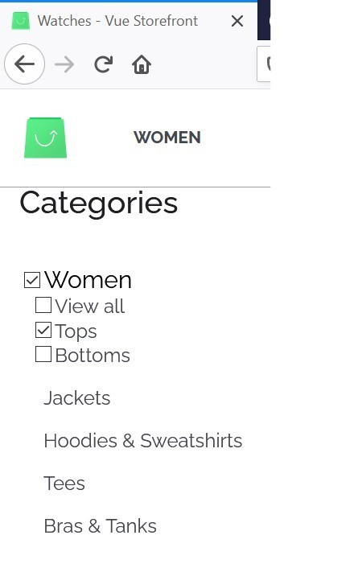

 <h1 align="center"> Test task vuestorefront for Tameson: </h1>

Change search results for type categories on default vsf capybara theme

### Prerequisites:

• Solution can be build on top of default Vuestorefront install with Capybara theme, demo of this theme is available on capybara.storefrontcloud.io
Last product expectations

- See the hierarchy of the category results (what are the parents and child categories)
- be able to filter the search product results (like on demo capybara theme by clicking on the category) -> change to using checkbox for filtering within search results
- be able to navigate to the actual category page by clicking on the specific category

Desired result:

The category results would include the parent hierarchy so the structure would be something like :

- woman
  - Tops
    - Bra & Tanks

## original state

## Desired result:

# Set-up

To start up and run the repo on your local machine on top of following the Vue storefront instructions, please watch [this](https://www.youtube.com/watch?v=i8zp48h90Oc&list=PL6JSOz3-TrFQ4s8prGw_SSxkdKNampFMu&index=2) video by Mohammad Kathawala

# Branches

## Test1

on this branch the search menus were re-arrenged to fit the
desired. please see [issue]()

